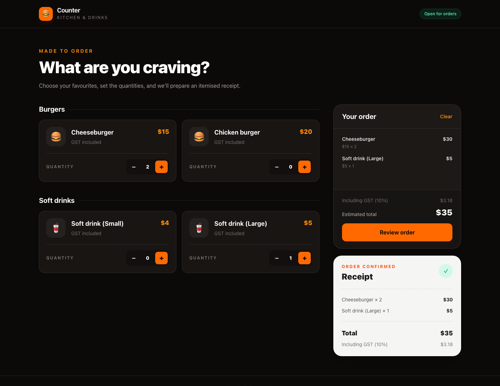
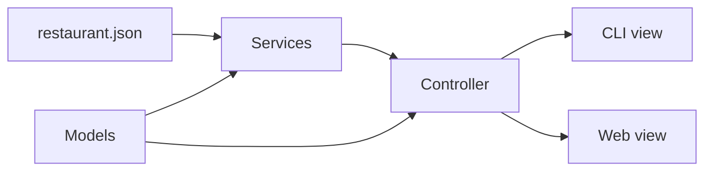

# Restaurant Order Processor

A TypeScript restaurant ordering application with interactive CLI and responsive web interfaces. Customers can select any quantity of configured products and receive an itemised total with the included GST.



## Features

- Dynamic menu, category, price, and GST configuration
- Interactive CLI powered by Inquirer
- Plain HTML web interface styled with Tailwind CSS
- Shared business logic across both interfaces
- Unit-tested calculations, validation, and formatting

## Architecture

The project follows a lightweight, MVC-inspired layered architecture:



### Key decisions

- **Controller boundary:** Both views access restaurant data and order processing through the same controller contract. Presentation code does not calculate prices or GST.
- **Configuration-driven menu:** `restaurant.json` is converted into typed models by the restaurant service, allowing products, categories, prices, and tax settings to change without modifying either view.
- **Shared, framework-independent core:** Services and models do not depend on the CLI or browser, so both interfaces produce consistent results without requiring a server.
- **Money in cents:** Monetary values are stored as integers to avoid floating-point rounding errors.
- **GST-inclusive pricing:** The configured rate is extracted from the inclusive total and rounded to the nearest cent.

## Run locally

```bash
npm install
npm run dev:cli
npm run dev:web
```

The web interface is available at the URL printed by Vite. The CLI produces receipts in this format:

```text
Cheeseburger x 2 $30
Soft drink (Large) x 1 $5

Total $35
Including GST ($3.18)
```

## Verify

```bash
npm test
npm run check
npm run build:web
```
